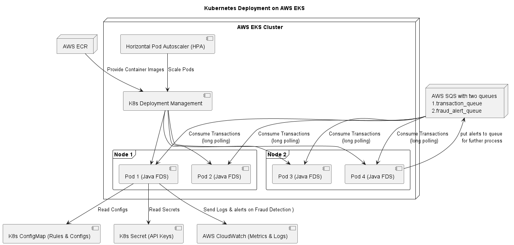

# 🧠 System Architecture for Real-Time Fraud Detection Service

This document provides an overview of the system architecture for the **Robust FDS (Fraud Detection Service)**, which is deployed on AWS using Kubernetes (EKS). It describes how the system is designed to meet requirements such as high availability, resilience, real-time processing, and observability.

---

## 🗺️ High-Level Architecture

### Key Components:

- **Transaction Processing Systems**: Send transaction events for fraud evaluation.
- **AWS SQS**: Two queues are used:
  - `transaction_queue`: Receives incoming transactions.
  - `fraud_alert_queue`: Used to publish detected fraud alerts.
- **AWS EKS Cluster**: Hosts the fraud detection service.
- **AWS CloudWatch**: Centralized logging and metrics for monitoring and alerting.

---

## 🧩 Kubernetes Deployment Architecture

### High Availability and Resilience:

- The application is deployed as a **Kubernetes Deployment** on **AWS EKS**.
- The cluster uses **multiple nodes** (`Node 1`, `Node 2`) and **multiple pods** (`Pod 1` to `Pod 4`) to ensure **high availability** and **fault tolerance**.
- **Horizontal Pod Autoscaler (HPA)** automatically scales the number of pods based on traffic or CPU usage.
- Pods read configurations via **Kubernetes ConfigMaps** and secure credentials via **Secrets**.
- **CloudWatch** receives logs and metrics for visibility and diagnostics.

---

## 🔄 Data Flow Overview

### Real-Time Processing and Communication:

1. Transactions are pushed into **SQS Transaction Queue**.
2. Java-based pods within the EKS cluster **consume messages using long polling** (20-second polling interval, up to 10 messages per batch).
3. The fraud detection **rule engine** evaluates transactions.
4. If fraud is detected:
   - Alerts are sent to the **fraud_alert_queue** for further action.
   - Logs and metrics are streamed to **AWS CloudWatch** for auditing and monitoring.

---

## ✅ How Requirements Are Fulfilled

### High Availability and Resilience
- **EKS Cluster** with multi-node setup.
- Kubernetes **Deployments** and **Services** ensure zero-downtime and traffic routing.
- **HPA** dynamically adjusts the number of running pods.
- SQS queues decouple components and buffer traffic spikes.

### Real-Time and Lightweight Design
- **Long polling** is used to keep latency low while minimizing AWS API calls.
- Each pod uses a 20-second wait time and pulls up to 10 messages per batch (tunable for throughput/latency balance).

### Observability and Logging
- Logs, alerts, and metrics are pushed to **AWS CloudWatch**.
- ConfigMaps and Secrets make configuration and credential management secure and centralized.

---

## 📂 Artifacts

- `high_level_arch.png`: High-level overview of the architecture.
- `k8s_arch.png`: Detailed EKS deployment architecture.
- `data_flow.png`: Data flow and processing path.

---

## 📜 License

This documentation is part of the **Robust FDS** project and licensed under the MIT License.
